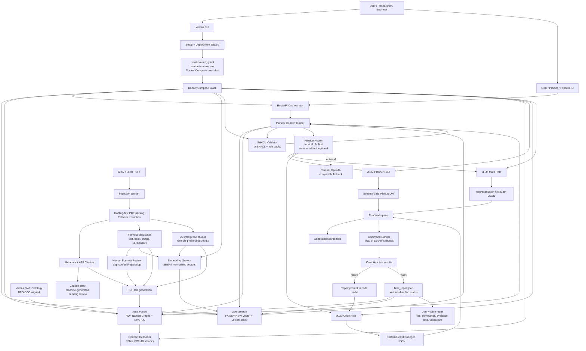
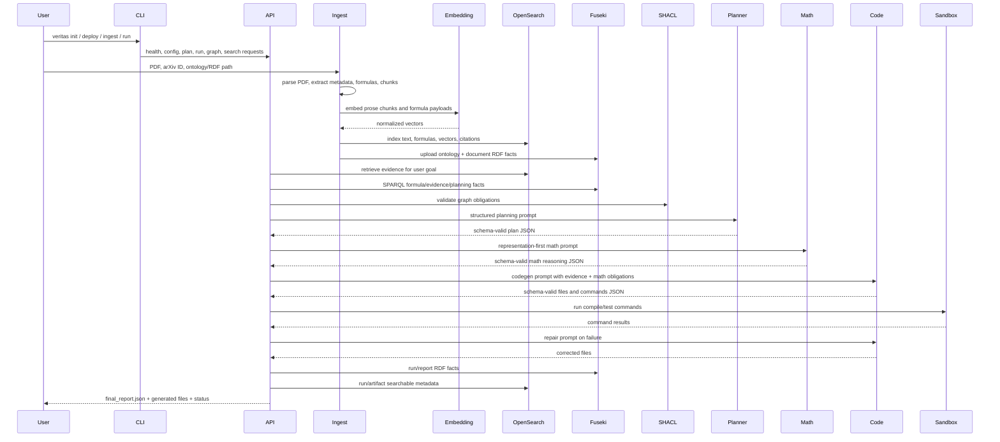
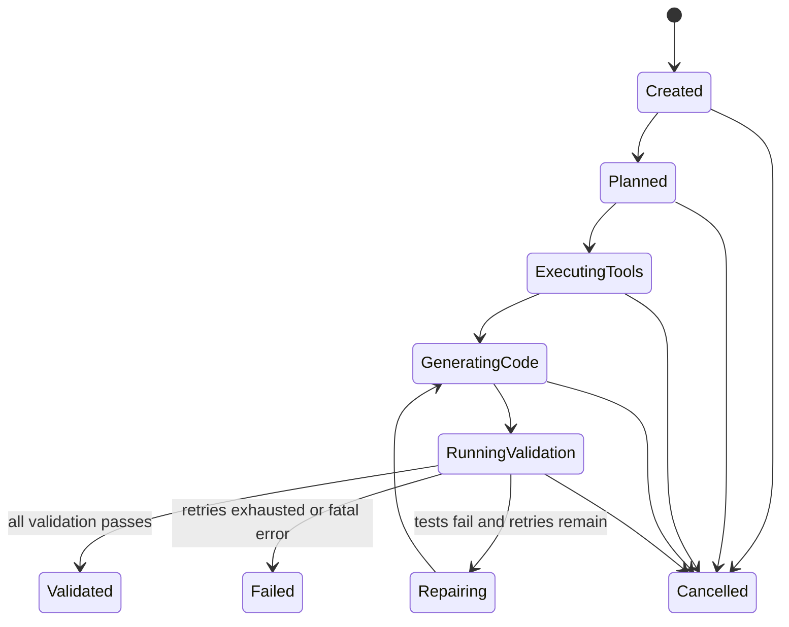
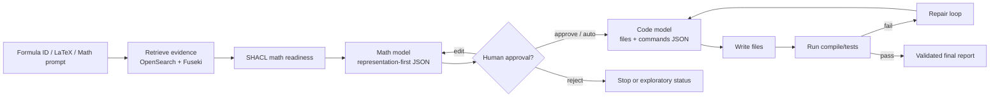

# Veritas Features

**Veritas** is a Docker-first, Rust-orchestrated, ontology-guided research-to-code system for math-heavy evidence-backed software engineering. It ingests research papers, extracts formulas and citations, builds OpenSearch and Fuseki knowledge layers, grounds agent planning in ontology facts and SHACL rules, routes model calls through vLLM-compatible providers, writes code into auditable run workspaces, validates generated packages, and produces traceable final reports.

This file catalogs the features implemented across Passes 1-5 of the production hardening plan.

> Production note: the source-level feature set and host-executable proof harness are present. Full production certification still requires a real host run with Cargo, Docker Compose, OpenSearch, Fuseki, SHACL, fake-vLLM E2E, and, when required, live vLLM/GPU model validation.

---

## Table of contents

1. [Architecture at a glance](#architecture-at-a-glance)
2. [Data lifecycle](#data-lifecycle)
3. [Pass-by-pass feature summary](#pass-by-pass-feature-summary)
4. [Rust API features](#rust-api-features)
5. [CLI features](#cli-features)
6. [Model serving and provider routing](#model-serving-and-provider-routing)
7. [Structured-output contracts](#structured-output-contracts)
8. [Run workspace, state, locking, resume, and audit](#run-workspace-state-locking-resume-and-audit)
9. [Command execution and sandboxing](#command-execution-and-sandboxing)
10. [OpenSearch vector memory](#opensearch-vector-memory)
11. [Embedding service](#embedding-service)
12. [Jena/Fuseki RDF graph features](#jenafuseki-rdf-graph-features)
13. [Ontology features](#ontology-features)
14. [BFO/CCO alignment](#bfocco-alignment)
15. [SKOS usage](#skos-usage)
16. [SHACL rules and validation features](#shacl-rules-and-validation-features)
17. [Document ingestion features](#document-ingestion-features)
18. [Formula extraction, LaTeX OCR, and symbolic shadows](#formula-extraction-latex-ocr-and-symbolic-shadows)
19. [Human checkpoints](#human-checkpoints)
20. [Math-to-code workflow](#math-to-code-workflow)
21. [SPARQL query pack and planner grounding](#sparql-query-pack-and-planner-grounding)
22. [Fake-vLLM and production proof harness](#fake-vllm-and-production-proof-harness)
23. [CI, validation, and audit](#ci-validation-and-audit)
24. [Known certification boundary](#known-certification-boundary)

---

## Architecture at a glance



### Architecture key

| Component | Responsibility | Data in | Data out |
|---|---|---|---|
| CLI | Non-coder setup, deployment, ingestion, run, review, and proof commands. | User answers, file paths, model choices, GPU choices. | `.veritas` config, Docker commands, API requests. |
| Rust API | Orchestrates retrieval, graph queries, model routing, runs, files, tests, retries, reports. | Goals, config, evidence, model responses. | Plans, generated files, command logs, final reports. |
| vLLM services | Serve planner, code, and math model roles through OpenAI-compatible HTTP. | Typed prompts and schema constraints. | Structured JSON model outputs. |
| OpenSearch | Stores chunks, formulas, citations, metadata, and vectors. | JSON documents + normalized vectors. | Lexical/vector/hybrid search results. |
| Embedding service | Converts text/formula payloads to normalized vectors. | Prose chunks, formula text, descriptions. | SBERT embeddings and vector norms. |
| Jena/Fuseki | Stores ontology and project facts in named RDF graphs. | OWL/RDF/Turtle facts. | SPARQL facts for planning and validation. |
| SHACL service | Runs closed-world completeness and readiness checks. | RDF data graph + SHACL shapes. | Conformance report and findings. |
| Openllet reasoner | Offline OWL-DL consistency/classification support. | OWL ontology. | Reasoning/check outputs. |
| Run workspace | Durable per-run audit boundary. | Plan, tool output, generated files, commands. | `state.json`, `events.jsonl`, reports, code artifacts. |

---

## Data lifecycle



---

## Pass-by-pass feature summary

### Pass 1 — Control-plane safety

| Feature | Files | Outcome |
|---|---|---|
| Provider abstraction | `apps/api/src/providers.rs` | Adds `ModelProvider`, `LocalVllmProvider`, `RemoteOpenAICompatibleProvider`, and `ProviderRouter`. |
| Failure taxonomy | `apps/api/src/providers.rs` | Categorizes provider failures as transport, timeout, model unavailable, GPU OOM, context too long, rate limit, auth, JSON, schema, or upstream error. |
| Local-first routing | `apps/api/src/providers.rs` | Routes planner/code/math calls through local vLLM first. |
| Remote fallback | `apps/api/src/providers.rs` | Allows explicitly configured OpenAI-compatible fallback when local failures are retryable. |
| Role-specific schema routing | `apps/api/src/schemas.rs`, `schemas/*.schema.json` | Planner, codegen, math, repair, and report payloads have separate schema identities. |
| Structured-output vLLM payloads | `apps/api/src/providers.rs`, `docker-compose.yml` | Sends JSON schema guidance to OpenAI-compatible vLLM calls and starts vLLM with structured-output backend flags. |

### Pass 2 — Execution safety

| Feature | Files | Outcome |
|---|---|---|
| Durable run workspaces | `apps/api/src/main.rs` | Every run stores request, state, events, plan, tools, SHACL, generated files, commands, retries, and final report. |
| Run locking | `apps/api/src/main.rs` | Uses atomic `run.lock` with stale lock handling to prevent concurrent mutation of a run. |
| Resume semantics | `apps/api/src/main.rs`, `apps/cli/src/main.rs` | Supports `/run/:run_id/resume` and `veritas run-resume`. |
| Cancellation | `apps/api/src/main.rs`, `apps/cli/src/main.rs` | Supports `/run/:run_id/cancel` and `veritas run-cancel`. |
| Persistent status | `apps/api/src/main.rs`, `apps/cli/src/main.rs` | Supports `/status/:run_id` and `veritas run-status`. |
| Command audit log | `apps/api/src/main.rs` | Writes `command_audit.jsonl` with command, cwd, exit code, stdout/stderr, and timing. |

### Pass 3 — Retrieval and ontology hardening

| Feature | Files | Outcome |
|---|---|---|
| OpenSearch status | `apps/api/src/main.rs`, `apps/cli/src/main.rs` | Adds `/opensearch/status` and CLI status command. |
| OpenSearch mapping | `apps/api/src/main.rs`, `schemas/opensearch/evidence_document.schema.json` | Produces production mapping with FAISS/HNSW vectors, keywords, text, nested formulas/citations. |
| OpenSearch migration | `apps/api/src/main.rs`, `apps/cli/src/main.rs` | Adds `/opensearch/migrate` and CLI migrate/dry-run commands. |
| Versioned index metadata | `apps/api/src/main.rs` | Adds mapping `_meta` and configurable mapping version. |
| Read/write aliases | `apps/api/src/main.rs`, `docker-compose.yml` | Adds read/write alias settings for safer index evolution. |
| Search fallback | `apps/api/src/main.rs` | Searches read alias, write alias, base index, and versioned index as available. |
| Named graph discipline | `apps/api/src/main.rs`, `services/ingestion/veritas_ingest/sinks.py` | Adds ontology, document, run, and validation graph URIs. |
| Graph endpoints | `apps/api/src/main.rs`, `apps/cli/src/main.rs` | Adds `/graphs`, `/graph/describe`, `/graph/upload`, `/graph/facts`. |
| Planner fact summary | `apps/api/src/main.rs`, `packages/ontology/queries/*.sparql` | Adds production SPARQL query pack summarization for planner grounding. |
| Run RDF upload | `apps/api/src/main.rs` | Converts run/report facts into named Fuseki graphs. |

### Pass 4 — Mathematical research workflow

| Feature | Files | Outcome |
|---|---|---|
| Formula image metadata | `services/ingestion/veritas_ingest/formula_images.py` | Adds optional formula-region rasterization metadata and fallback status. |
| LaTeX OCR provider | `services/ingestion/veritas_ingest/latex_ocr.py` | Adds configurable OCR modes: `none`, `heuristic`, `command`, and `http`. |
| Docling formula candidates | `services/ingestion/veritas_ingest/formulas.py` | Adds Docling visual formula candidate extraction and merging. |
| Human formula review | `services/ingestion/veritas_ingest/human_review.py`, `apps/cli/src/main.rs` | Adds approve/edit/reject/skip/auto-approve review flow for formula objects. |
| Math-to-code endpoint | `apps/api/src/main.rs`, `schemas/math_reasoning.schema.json` | Adds `/math-to-code` with representation-first math reasoning before code generation. |
| Human checkpoint endpoint | `apps/api/src/main.rs`, `schemas/human_checkpoint.schema.json` | Adds `/human/checkpoint` and math-to-code approval flow. |
| Math SHACL rules | `packages/ontology/shacl/veritas-math.shacl.ttl` | Adds representation-first math readiness checks. |
| Ontology math properties | `packages/ontology/veritas.owl` | Adds formula image, OCR, normalized expression, axiom map, proof status, and human validation properties. |

### Pass 5 — Deployment and production proof

| Feature | Files | Outcome |
|---|---|---|
| Fake-vLLM E2E stack | `docker-compose.e2e.yml`, `tests/fakes/fake_vllm_server.py` | Tests planner/code/math orchestration without downloading real models. |
| Fake embedding service | `tests/fakes/fake_embedding_server.py`, `tests/fakes/Dockerfile.embedding` | Enables CI/E2E without SBERT download. |
| Sample PDF fixture | `tests/fixtures/sample_math_paper.pdf`, `data/fixtures/sample_math_paper.pdf` | Provides repeatable PDF ingestion fixture. |
| E2E proof scripts | `scripts/e2e/*.sh`, `scripts/e2e/assert-e2e-result.py` | Validates service readiness, ontology upload, ingestion, `/plan`, `/run`, and final report. |
| GPU validation scripts | `scripts/e2e/gpu-validation.sh`, `apps/cli/src/main.rs` | Checks GPU inventory and vLLM layout assumptions. |
| Live vLLM smoke | `scripts/e2e/live-vllm-smoke.sh` | Optional real vLLM `/v1/models` validation. |
| Host validation | `scripts/validate-host.sh` | Runs Python, Rust, Docker config, E2E, and optional live model checks. |
| Production acceptance | `scripts/production-acceptance.sh` | Executes strict production gate. |
| CI workflows | `.github/workflows/*.yml` | Adds Python, Rust, and Docker fake-E2E workflows. |

---

## Rust API features

| API feature | Endpoint | Purpose |
|---|---|---|
| Health | `GET /health` | Fast API health check. |
| Readiness | `GET /ready` | Verifies required services are reachable. |
| Model status | `GET /models` | Shows planner/code/math role configuration and provider summary. |
| Run list | `GET /status` | Lists recent runs. |
| Run status by ID | `GET /status/:run_id` | Reads persisted run status from disk. |
| Resume run | `POST /run/:run_id/resume` | Re-enters a previously started run using persisted artifacts. |
| Cancel run | `POST /run/:run_id/cancel` | Writes a cancellation marker and records event. |
| Graph status | `GET /graph/status` | Checks Fuseki graph endpoints. |
| Graph list | `GET /graphs` | Lists/returns configured graph state. |
| Graph describe | `POST /graph/describe` | Counts or summarizes a named graph. |
| Graph upload | `POST /graph/upload` | Uploads Turtle RDF into a named graph. |
| Graph facts | `GET /graph/facts` | Produces ontology-derived planner fact summary. |
| SPARQL | `POST /sparql` | Runs SPARQL query against Fuseki. |
| Search | `POST /search` | Runs OpenSearch lexical/vector/hybrid retrieval. |
| OpenSearch status | `GET /opensearch/status` | Checks index/alias status. |
| OpenSearch mapping | `GET /opensearch/mapping` | Returns expected production mapping. |
| OpenSearch migrate | `POST /opensearch/migrate` | Creates or updates OpenSearch index/aliases. |
| Math-to-code | `POST /math-to-code` | Runs representation-first formula/problem-to-code workflow. |
| Human checkpoint | `POST /human/checkpoint` | Records review/approval decisions. |
| Plan | `POST /plan` | Calls planner with evidence + graph facts and returns structured plan. |
| Run | `POST /run` | Executes bounded planning/code/test/repair loop. |
| LLM chat | `POST /llm/chat` | Direct role-specific model call for planner/code/math. |

---

## CLI features

| Command | Purpose |
|---|---|
| `veritas welcome` | Prints logo, tagline, and guided options. |
| `veritas init` / `veritas configure` | Interactive setup/deployment wizard that writes `.veritas` runtime config. |
| `veritas setup-validate` | Validates generated setup state. |
| `veritas deploy` | Launches Docker Compose using generated runtime environment. |
| `veritas e2e-fake` | Runs local fake-vLLM Docker E2E proof path. |
| `veritas validate-host` | Runs host validation script. |
| `veritas production-accept` | Runs strict production acceptance gate. |
| `veritas prompt` | Guided prompt entry point. |
| `veritas start` / `up` / `down` | Controls Docker services. |
| `veritas health` / `ready` | Checks API and service readiness. |
| `veritas models` | Shows configured model roles and endpoints. |
| `veritas gpu-inspect` | Displays detected NVIDIA GPU inventory. |
| `veritas gpu-validate` | Validates GPU layout and model sizing assumptions. |
| `veritas opensearch-status` | Shows OpenSearch index/alias status. |
| `veritas opensearch-mapping` | Prints production mapping. |
| `veritas opensearch-migrate` | Applies OpenSearch mapping/index/alias migration. |
| `veritas graph-list` | Lists graph state. |
| `veritas graph-facts` | Displays ontology-derived planner fact summary. |
| `veritas graph-describe` | Counts or summarizes a named graph. |
| `veritas graph-upload` | Uploads Turtle RDF into Fuseki. |
| `veritas math-to-code` | Converts formula/prompt into representation-first code workflow. |
| `veritas review-formulas` | Reviews extracted formulas from chunk JSONL. |
| `veritas ingest-arxiv` | Ingests arXiv search results. |
| `veritas ingest-pdf` | Ingests local PDF. |
| `veritas upload-ontology` | Uploads Veritas OWL ontology into Fuseki. |
| `veritas generate-code` | Calls the production `/run` API path. |
| `veritas run` | Executes full autonomous run. |
| `veritas run-status` / `run-resume` / `run-cancel` | Manages persisted runs. |
| `veritas search` | Queries OpenSearch. |
| `veritas sparql` | Executes SPARQL. |
| `veritas plan` / `ask` | Requests ontology-grounded plan. |
| `veritas chat` | Calls configured model role directly. |

---

## Model serving and provider routing

Veritas uses vLLM as the local model-serving default. The Rust API does not serve model weights itself; it communicates with vLLM's OpenAI-compatible HTTP endpoints.

| Feature | Implementation |
|---|---|
| Planner role | Default `Qwen/Qwen2.5-Coder-7B-Instruct`; served as `veritas-planner`. |
| Code role | Default `Qwen/Qwen2.5-Coder-14B-Instruct`; served as `veritas-code`. |
| Math role | Default `allenai/Olmo-3-7B-Instruct`; served as `veritas-math`. |
| Remote fallback | Optional OpenAI-compatible fallback configured by environment/config. |
| Provider abstraction | `apps/api/src/providers.rs` defines provider trait and router. |
| Failure taxonomy | Provider errors classify timeout, transport, OOM, context, rate limit, auth, JSON, schema, and upstream failures. |
| vLLM structured outputs | Compose passes `--structured-outputs-config.backend=auto`. |
| Multi-GPU knobs | Per-role GPU IDs, tensor parallel size, pipeline parallel size, max length, dtype, and GPU memory utilization. |
| Live validation | Optional `scripts/e2e/live-vllm-smoke.sh` checks real `/v1/models`. |

---

## Structured-output contracts

Veritas treats model output as untrusted until it is structured and validated.

| Schema | File | Used by |
|---|---|---|
| Planner | `schemas/planner.schema.json` | `/plan`, `/run` planning stage. |
| Codegen | `schemas/codegen.schema.json` | Code file generation and commands. |
| Math reasoning | `schemas/math_reasoning.schema.json` | Representation-first math analysis. |
| Repair | `schemas/repair.schema.json` | Failure-to-repair model loop. |
| Human checkpoint | `schemas/human_checkpoint.schema.json` | Human approval/edit/reject records. |
| Run report | `schemas/run_report.schema.json` | Final report shape. |
| OpenSearch evidence document | `schemas/opensearch/evidence_document.schema.json` | Search/index document contract. |

### Structured-output behavior

- Planner responses must produce a plan object with objective, steps, risks, validation gates, and tool calls.
- Codegen responses must produce files, commands, assumptions, validation summary, and artifact status.
- Math responses must produce representation-first reasoning fields such as surface phenomenon, representation hypothesis, transformation space, invariants, compression fidelity, and transfer tests.
- Repair responses must be tied to observed command/test failures.
- Human checkpoint responses record review phase, decision, reviewer, notes, and timestamps.

---

## Run workspace, state, locking, resume, and audit

Each `/run` creates a durable workspace under the configured runs directory.

### Run workspace artifacts

| File | Meaning |
|---|---|
| `request.json` | Original user task and language request. |
| `state.json` | Current run state and summary. |
| `events.jsonl` | Append-only event stream. |
| `run.lock` | Atomic lock that prevents concurrent mutation. |
| `plan_envelope.json` | Planner output and route metadata. |
| `tool_outputs.json` | Planner-selected tool results. |
| `automatic_shacl_report.json` | SHACL gate output. |
| `command_audit.jsonl` | Command execution log. |
| `validation_results.json` | Compile/test/validation result snapshot. |
| `retry_history.json` | Failure and repair attempts. |
| `final_report.json` | Final run report and artifact status. |

### State transitions



---

## Command execution and sandboxing

Veritas supports local command execution for development and Docker sandbox command execution for safer validation.

| Feature | Description |
|---|---|
| Command allowlist | Restricts generated commands to approved compile/test commands. |
| Audit logs | Writes command, purpose, cwd, stdout, stderr, exit code, and duration. |
| Docker sandbox runner | Optional mode using `docker/sandbox/rust.Dockerfile`. |
| Network control | Sandbox mode disables network by default. |
| Workspace boundary | Sandbox mounts only the run workspace for generated code validation. |
| Resource controls | Sandbox invocation supports CPU/memory/time constraints. |

---

## OpenSearch vector memory

OpenSearch is Veritas' default vector and lexical retrieval engine.

### Indexing features

| Feature | Description |
|---|---|
| FAISS/HNSW vectors | Uses OpenSearch `knn_vector` with FAISS/HNSW and cosine similarity. |
| Normalized embeddings | Embeddings are expected to be normalized for cosine search. |
| Versioned index | Uses configurable versioned index name. |
| Read/write aliases | Separates read and write alias behavior for migration safety. |
| Mapping metadata | Adds mapping version metadata. |
| Nested formulas | Formula objects are indexed as nested metadata. |
| Nested citations | Citation objects can be indexed as structured metadata. |
| Exact IDs | Document, chunk, formula, run, and model identifiers map to keyword fields. |
| Searchable prose | Titles, abstracts, chunk text, formula descriptions, and summaries map to text fields. |
| Formula exact + fuzzy | Formula LaTeX supports search and exact raw subfield semantics. |

### Core OpenSearch document fields

| Field family | Type intent |
|---|---|
| `doc_id`, `chunk_id`, `formula_id`, `run_id`, `sha256` | `keyword` |
| `title`, `abstract`, `chunk_text`, `formula_description` | `text` |
| `formula_latex`, `normalized_latex` | `text` with exact-match support where configured |
| `embedding`, `chunk_embedding`, `formula_embedding` | `knn_vector` |
| `formulas`, `citations`, `validation_results` | `nested` |
| `confidence`, `embedding_norm` | numeric |
| `created_at`, `ingested_at`, `published_at` | date/date-like |

---

## Embedding service

The embedding service wraps SentenceTransformers and defaults to `Muennighoff/SBERT-base-nli-v2`.

| Endpoint | Purpose |
|---|---|
| `GET /health` | Returns model, dimension, and normalization default. |
| `POST /embed` | Embeds one or more text payloads. |
| `POST /cosine` | Computes pairwise cosine score for diagnostics. |

Embedding outputs include model name, dimension, normalized flag, vectors, and vector norms.

---

## Jena/Fuseki RDF graph features

Fuseki stores ontology schema and project instance facts. It does **not** store raw PDF binaries. PDFs stay in file/object storage; Fuseki stores facts and links.

### Named graph policy

| Graph | Example URI | Contents |
|---|---|---|
| Ontology graph | `urn:veritas:graph:ontology` | Veritas OWL ontology and supporting ontology data. |
| Document graph | `urn:veritas:graph:document:<sha256>` | Source documents, chunks, citations, formulas, formula metadata. |
| Run graph | `urn:veritas:graph:run:<run_id>` | Plan, tasks, code artifacts, tool calls, risks, human approvals. |
| Validation graph | `urn:veritas:graph:validation:<run_id>` | Validation checks, command results, SHACL findings, artifact status. |

### RDF entities produced by ingestion and runs

| Entity | RDF role |
|---|---|
| PDF/paper | `veritas:SourceDocument` |
| Text chunk | `veritas:RetrievalResult` |
| Formula | `veritas:SymbolicShadow` |
| Citation | Dublin Core citation and source metadata. |
| Generated code file | `veritas:SourceCodeArtifact` |
| Build output | `veritas:BuildArtifact` |
| Command/test result | `veritas:VerificationResult` / validation facts. |
| Human approval | Human checkpoint/review fact. |
| Risk and mitigation | `veritas:Risk`, `veritas:MitigationSpecification`. |

---

## Ontology features

The ontology is in `packages/ontology/veritas.owl`.

### Ontology summary

| Feature | Description |
|---|---|
| OWL-DL discipline | Uses separate classes, individuals, object properties, datatype properties, and annotation properties. |
| BFO/CCO alignment | Imports BFO and Common Core Ontology modules. |
| SKOS annotations | Uses `skos:definition` for human-readable definitions. |
| Modular design | Classes and properties include `veritas:module` annotations. |
| Cross-domain scope | Connects planning, math research, code, DevOps, validation, risk, evidence, and control flow. |
| Symbolic shadows | Treats formulas/equations as artifacts pointing to deeper generative structure. |
| Inferred classes | Defines useful classes such as executable plans, mitigated risks, well-grounded invariants, and well-formed loops. |
| Runtime fact support | Supports documents, formulas, chunks, generated source, builds, validation results, and run facts. |

### Ontology counts

| OWL entity kind | Count |
|---|---:|
| Classes | 159 |
| Object properties | 75 |
| Datatype properties | 28 |
| Annotation properties | 11 |

### Ontology modules

| Module | Class count | Examples |
|---|---:|---|
| `core` | 15 | `InformationArtifact`, `Capability`, `EngineeringProcess`, `PrescriptiveArtifact`. |
| `planning` | 17 | `Objective`, `Plan`, `TaskSpecification`, `AcceptanceCriterion`, `EngineeringDecision`. |
| `mathematical-research` | 23 | `SymbolicShadow`, `Invariant`, `RepresentationMap`, `TransformationFamily`, `GenerativeNecessityClaim`. |
| `software-engineering` | 18 | `SourceCodeArtifact`, `BuildArtifact`, `TestSpecification`, `Repository`, `ModuleSpecification`. |
| `risk` | 22 | `Risk`, `MitigatedRisk`, `MathematicalRisk`, `OperationalRisk`, `ImpactEstimate`. |
| `evidence-validation` | 13 | `EvidenceArtifact`, `RetrievalResult`, `ValidationCheckSpecification`, `Finding`, `ConfidenceMeasurement`. |
| `control-flow-correctness` | 21 | `LoopSpecification`, `TerminationCondition`, `Precondition`, `Postcondition`, `MalformedControlFlowFinding`. |
| `devops-sre` | 17 | `DeploymentUnitSpecification`, `RuntimeEnvironmentSpecification`, `ObservableSignal`, `Runbook`, `ServiceLevelObjective`. |
| `simplicity-design-quality` | 12 | `SimplicityQuality`, `ComplexityQuality`, `CouplingQuality`, `CapabilityToComplexityRatio`. |
| `simplicity` | 1 | `DesignQuality`. |

### Core ontology chain

```text
Objective
→ EvidenceArtifact
→ SymbolicShadow
→ Invariant
→ Risk
→ Plan
→ TaskSpecification
→ SourceCodeArtifact
→ ValidationCheckSpecification
→ BuildArtifact
```

This chain is the core Veritas reasoning model. It prevents the system from going directly from a prompt or formula to code without evidence, invariants, risk analysis, planning, and validation.

---

## BFO/CCO alignment

Veritas is a BFO/CCO-aligned application ontology.

### Imported ontology modules

| Import | Purpose |
|---|---|
| BFO core | Upper ontology foundation for processes, qualities, realizable entities, and continuants/occurrents. |
| CCO Information Entity Ontology | Supports information artifacts, descriptive/prescriptive/representational entities. |
| CCO Event Ontology | Supports event/process modeling. |
| CCO Agent Ontology | Supports agent/actor concepts. |
| CCO Artifact Ontology | Supports artifacts, build outputs, software artifacts, and documents. |
| CCO Quality Ontology | Supports quality and measurement concepts. |
| CCO Extended Relation Ontology | Supports relation vocabulary. |
| CCO Time Ontology | Supports temporal and planning horizon concepts. |
| CCO Units of Measure Ontology | Supports measurement values. |

### Example BFO/CCO mappings

| Veritas class | BFO/CCO parent intent |
|---|---|
| `EngineeringProcess` | BFO process. |
| `Capability` | BFO realizable entity. |
| `DesignQuality` | BFO quality. |
| `InformationArtifact` | CCO information content entity. |
| `RepresentationalArtifact` | CCO representational information artifact. |
| `DescriptiveArtifact` | CCO descriptive information artifact. |

### Why this matters

BFO/CCO alignment keeps Veritas from collapsing everything into software labels. Research objectives, evidence, formulas, risks, code, tests, deployments, and runtime observations become typed entities in a cross-domain semantic graph.

---

## SKOS usage

Veritas uses SKOS primarily for human-readable conceptual definitions.

| SKOS feature | Usage |
|---|---|
| `skos:definition` | Definitions for ontology classes, object properties, datatype properties, and annotation properties. |
| RDFS labels + SKOS definitions | Each ontology element can have a readable label and explanation. |
| RDF ingestion compatibility | Ingested semantic metadata may include `rdfs_label_*` and `skos_def_*` style source fields. |

Veritas does not require a full SKOS concept scheme for operation. SKOS is used as a documentation and semantic annotation layer that makes the ontology easier for humans and agents to interpret.

---

## SHACL rules and validation features

SHACL is used for closed-world validation of completeness and readiness. OWL-DL can classify and reason under open-world semantics; SHACL checks whether required production facts are actually present.

### SHACL service

| Feature | File | Description |
|---|---|---|
| FastAPI validator | `services/shacl/app.py` | Provides `/health` and `/validate`. |
| pySHACL engine | `services/shacl/app.py` | Validates Turtle data against SHACL shapes with RDFS inference. |
| Docker service | `services/shacl/Dockerfile`, `docker-compose.yml` | Runs SHACL validation as a Compose service. |
| Automatic gate | `apps/api/src/main.rs` | Runs before code generation / production status transitions where configured. |

### Core SHACL rule pack

File: `packages/ontology/shacl/veritas-core.shacl.ttl`

| Shape | Target | Rule |
|---|---|---|
| `ResearchObjectiveShape` | `veritas:ResearchObjective` | Must be achieved by at least one plan/task/process/result. |
| `PlanShape` | `veritas:Plan` | Must have at least one `TaskSpecification` and validation check. |
| `RiskShape` | `veritas:Risk` | Must be mitigated, accepted by decision, or blocked. |
| `SymbolicShadowShape` | `veritas:SymbolicShadow` | Must be derived from evidence, have expression text, and record formula source. |
| `InvariantShape` | `veritas:Invariant` | Must specify a transformation family. |
| `RepresentationMapShape` | `veritas:RepresentationMap` | Must map from surface phenomenon to latent structure. |
| `GenerativeNecessityClaimShape` | `veritas:GenerativeNecessityClaim` | Must be evidence-backed, have proof status, and include transfer test. |
| `SourceCodeArtifactShape` | `veritas:SourceCodeArtifact` | Must have validation checks and tests. |
| `BuildArtifactShape` | `veritas:BuildArtifact` | Must have explicit status. |
| `LoopSpecificationShape` | `veritas:LoopSpecification` | Must have a termination condition. |
| `FormulaImageReviewShape` | `veritas:SymbolicShadow` | Must have extraction confidence and human validation status. |
| `MathDiscoveryReadinessShape` | `veritas:MathematicalDiscoveryArtifact` | Must identify invariants or be explicitly exploratory/speculative. |
| `Pass4SymbolicShadowMathReadinessShape` | `veritas:SymbolicShadow` | Requires human validation status and extraction confidence before math-to-code. |
| `Pass4MathematicalDiscoveryArtifactShape` | `veritas:MathematicalDiscoveryArtifact` | Requires axiom map and representation map. |

### Math SHACL rule pack

File: `packages/ontology/shacl/veritas-math.shacl.ttl`

| Shape | Target | Rule |
|---|---|---|
| `SymbolicShadowMathReadinessShape` | `veritas:SymbolicShadow` | Formula must be evidence-derived, preserve expression/LaTeX, record formula source, human status, and confidence. |
| `RepresentationMapMathShape` | `veritas:RepresentationMap` | Must identify surface phenomenon, latent structure, and preserved invariant. |
| `InvariantMathShape` | `veritas:Invariant` | Must identify transformation family. |
| `GenerativeNecessityMathShape` | `veritas:GenerativeNecessityClaim` | Must have evidence, proof status, and transfer test. |
| `MathematicalDiscoveryArtifactReadinessShape` | `veritas:MathematicalDiscoveryArtifact` | Must include axiom map, representation map, and invariant or exploratory/speculative status. |

---

## Document ingestion features

| Feature | Files | Description |
|---|---|---|
| Docling-first parsing | `services/ingestion/veritas_ingest/docling_pdf.py` | Uses Docling when available and falls back when needed. |
| PDF fallback extraction | `services/ingestion/veritas_ingest/docling_pdf.py` | Uses fallback extraction path for non-Docling environments. |
| APA citations | `services/ingestion/veritas_ingest/citations.py` | Builds machine-generated APA citation metadata. |
| 25-word chunking | `services/ingestion/veritas_ingest/chunking.py` | Chunks prose at target word count extended to punctuation. |
| Formula preservation | `services/ingestion/veritas_ingest/chunking.py` | Avoids splitting formula spans and emits formula chunks. |
| Formula metadata | `services/ingestion/veritas_ingest/formulas.py` | Tracks LaTeX, normalized LaTeX, formula source, confidence, context, page/bbox where available. |
| Formula image metadata | `services/ingestion/veritas_ingest/formula_images.py` | Adds image path/status metadata when page/bbox extraction supports it. |
| LaTeX OCR | `services/ingestion/veritas_ingest/latex_ocr.py` | Provides pluggable OCR interface with heuristic/command/http modes. |
| OpenSearch indexing | `services/ingestion/veritas_ingest/sinks.py` | Indexes chunks, formulas, metadata, embeddings. |
| RDF Turtle output | `services/ingestion/veritas_ingest/sinks.py` | Converts source documents, chunks, formulas, citations into RDF. |
| Fuseki upload manifest | `services/ingestion/veritas_ingest/cli.py` | Writes `latest-fuseki-upload-manifest.json`. |

---

## Formula extraction, LaTeX OCR, and symbolic shadows

Veritas treats formulas as `SymbolicShadow` objects. A symbolic shadow is not the mathematical truth itself; it is an equation, theorem, diagram, or algorithmic expression that records deeper generative structure.

### Formula object fields

| Field | Meaning |
|---|---|
| `formula_id` | Stable formula identifier. |
| `doc_id` / `paper_id` | Source document identifier. |
| `chunk_id` | Chunk containing or neighboring the formula. |
| `latex` | Extracted or OCR-produced LaTeX. |
| `normalized_latex` | Normalized expression for search/comparison. |
| `description` | Machine/human description of formula meaning. |
| `page` / `bbox` | Visual source coordinates when available. |
| `formula_image_path` | Rasterized formula image path when available. |
| `formula_image_status` | `rendered`, `missing_bbox`, `pymupdf_unavailable`, etc. |
| `latex_ocr_status` | OCR outcome/status. |
| `ocr_engine` | OCR provider/mode. |
| `confidence` | Extraction confidence value. |
| `human_validated` | Whether a human approved/edited/rejected/auto-approved. |

### Representation-first rule

The math workflow does not ask only “what code implements this formula?” It asks:

```text
Surface Phenomenon
→ Representation Hypothesis
→ Candidate Representation Map
→ Latent Structure
→ Primitive Ontology
→ Transformation Space
→ Constraint Geometry
→ Invariants
→ Compression Fidelity
→ Recursive Closure
→ Generative Necessity
→ Symbolic Shadows
→ Transfer Tests
→ Code + Validation
```

---

## Human checkpoints

| Checkpoint | Status | Purpose |
|---|---|---|
| Formula review | Implemented source-level | Approve/edit/reject extracted formulas. |
| Math-to-code approval | Implemented source-level | Approve representation-first math reasoning before code generation. |
| Citation status | Metadata exists | Citation confirmation remains a future UX hardening area. |
| Plan approval | Partial | Human checkpoint schema exists; broader UX still evolving. |
| Code architecture approval | Partial | Can be represented but not fully polished as a CLI flow. |
| Validation approval | Partial | Validation is machine-recorded; human signoff can be modeled through checkpoint schema. |

Human decisions are intended to become run events and RDF facts so the final artifact can show which claims were machine-derived and which were human approved.

---

## Math-to-code workflow

The `/math-to-code` endpoint and CLI command convert a raw formula, formula ID, or math prompt into a representation-first code generation workflow.

### Math-to-code phases



### Math reasoning output includes

- concise summary
- axiom map
- surface phenomenon
- representation hypothesis
- candidate representation map
- primitive ontology
- transformation space
- constraint geometry
- invariants
- compression fidelity
- recursive closure
- generative necessity
- symbolic shadows
- transfer tests
- risks
- validation requirements
- status label

---

## SPARQL query pack and planner grounding

The planner does not directly query OpenSearch or Fuseki. Rust builds a planner context by executing retrieval and SPARQL tools, then passes compact evidence and graph facts to the planner model.

### Query pack examples

| Query | Purpose |
|---|---|
| `evidence_chunks.sparql` | Returns retrieval chunks, source docs, chunk IDs, titles, and text. |
| `formula_traceability.sparql` | Returns formulas, expression text, source chunk/document, and title. |
| `formulas_without_invariants.sparql` | Finds formula artifacts not linked to invariants. |
| `risks_without_mitigation.sparql` | Finds risks without mitigation or acceptance. |
| `plans_without_validation.sparql` | Finds plans lacking validation checks. |
| `unvalidated_code_artifacts.sparql` | Finds generated code lacking validation. |
| `builds_without_tests.sparql` | Finds build artifacts lacking test evidence. |
| `loops_without_termination.sparql` | Finds retry/loop specs without termination conditions. |
| `objectives_blocked_by_assumptions.sparql` | Finds objectives blocked by unverified assumptions. |
| `deployment_units_without_observability.sparql` | Finds operations gaps. |
| `math_claims_without_transfer_tests.sparql` | Finds mathematical claims lacking transfer tests. |

---

## Fake-vLLM and production proof harness

The fake-vLLM harness proves the orchestration path without downloading large models.

| Feature | File | Description |
|---|---|---|
| Fake planner/code/math model | `tests/fakes/fake_vllm_server.py` | OpenAI-compatible fake model server returning role-specific JSON. |
| Fake embedding | `tests/fakes/fake_embedding_server.py` | Returns deterministic 768-dimensional embeddings. |
| E2E Compose | `docker-compose.e2e.yml` | Overrides vLLM and embedding services with fakes. |
| Runtime env writer | `scripts/e2e/write-fake-runtime-env.sh` | Generates `.veritas/runtime.env` for E2E. |
| Readiness wait | `scripts/e2e/wait-ready.sh` | Waits for required services. |
| Service validation | `scripts/e2e/validate-services.sh` | Checks API/service endpoints. |
| Ontology upload proof | `scripts/e2e/upload-ontology.sh` | Uploads ontology to Fuseki. |
| PDF ingestion proof | `scripts/e2e/ingest-fixture.sh` | Ingests sample PDF. |
| Plan proof | `scripts/e2e/plan-fixture.sh` | Calls `/plan`. |
| Run proof | `scripts/e2e/run-fixture.sh` | Calls `/run`. |
| Result assertion | `scripts/e2e/assert-e2e-result.py` | Checks final report and artifact behavior. |
| Full E2E | `scripts/e2e/full-fake-vllm-e2e.sh` | Runs the complete fake-vLLM proof. |
| Host validation | `scripts/validate-host.sh` | Runs Rust/Python/Docker/E2E checks. |
| Production acceptance | `scripts/production-acceptance.sh` | Executes strict release gate. |

---

## CI, validation, and audit

| Feature | File | Purpose |
|---|---|---|
| Python CI | `.github/workflows/python.yml` | Runs Python compile/tests. |
| Rust CI | `.github/workflows/rust.yml` | Runs Cargo fmt/check/test/clippy. |
| Docker E2E CI | `.github/workflows/docker-e2e.yml` | Runs fake-vLLM Docker proof path. |
| Spec validator | `scripts/validate-spec.py` | Source-level feature checks. |
| Host validator | `scripts/validate-host.sh` | Host-level production checks. |
| Audit updater | `scripts/update-audit.py` | Updates `AUDIT.md` from validation results. |
| Validation matrix | `VALIDATION_MATRIX.md` | Tracks source/Python/Rust/Docker/live status. |
| Audit report | `AUDIT.md` | Records pass status, commands run, and host boundary. |

---

## Known certification boundary

The codebase includes the Pass 5 production proof harness, but the following checks must pass on a real host before calling the system production-certified:

```bash
cargo fmt --all -- --check
cargo check --workspace
cargo test --workspace
cargo clippy --workspace --all-targets -- -D warnings

docker compose --env-file .veritas/runtime.env config
scripts/e2e/full-fake-vllm-e2e.sh
scripts/validate-host.sh
```

For live model certification:

```bash
VERITAS_REQUIRE_LIVE_VLLM_VALIDATION=true scripts/production-acceptance.sh
```

Until those commands pass on the target machine, the honest status is:

```text
Source-level features: implemented through Pass 5.
Production proof harness: implemented.
Live production certification: pending host execution.
```
