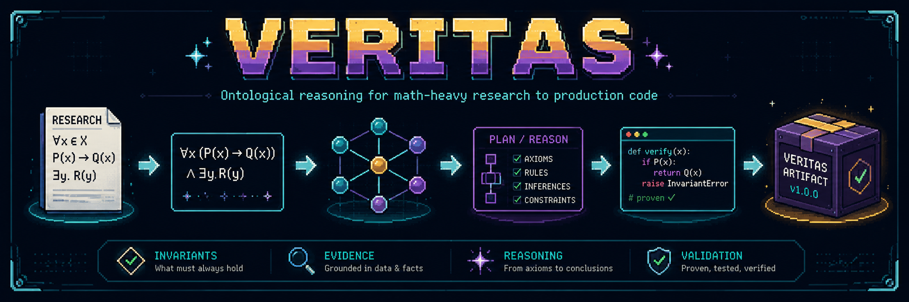
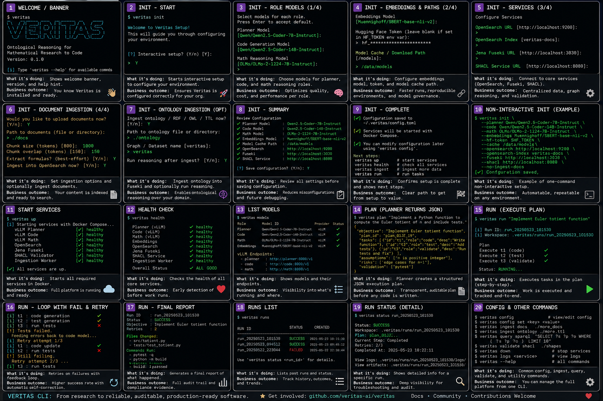

# Veritas

**Math-heavy evidence-backed research and development software engineering agent.**

[Download research paper here](https://github.com/daddydrac/veritas/blob/main/veritas_paper.pdf)




Veritas, built in Rust, is an open-source (see LICENSE.md for limits), Docker-first agentic system for turning math-heavy
research into auditable engineering plans, searchable evidence, ontology-grounded
analysis, and validated distributable code packages. It combines PDF ingestion,
formula extraction, OpenSearch FAISS/HNSW vector RAG, Jena/Fuseki ontology graphs,
SPARQL grounding, vLLM model serving, and representation-first symbolic mathematical
analysis with ontological reasoning.

```text
██╗   ██╗███████╗██████╗ ██╗████████╗ █████╗ ███████╗
██║   ██║██╔════╝██╔══██╗██║╚══██╔══╝██╔══██╗██╔════╝
██║   ██║█████╗  ██████╔╝██║   ██║   ███████║███████╗
╚██╗ ██╔╝██╔══╝  ██╔══██╗██║   ██║   ██╔══██║╚════██║
 ╚████╔╝ ███████╗██║  ██║██║   ██║   ██║  ██║███████║
  ╚═══╝  ╚══════╝╚═╝  ╚═╝╚═╝   ╚═╝   ╚═╝  ╚═╝╚══════╝
```

## What problem does Veritas solve?

Research-to-production work usually loses the reasoning chain:

```text
paper → formulas → assumptions → invariants → implementation plan → code → tests → deployment
```

Veritas preserves that chain. It maps papers, chunks, formulas, evidence, risks,
assumptions, and generated artifacts into a semantic graph so agents can query and
ground their planning before producing code.

[OWL-DL Compliant Ontology](https://github.com/daddydrac/veritas/blob/main/packages/ontology/veritas.owl)

The Veritas ontology is the semantic operating model for the project. It defines how Veritas represents mathematical research, evidence, planning, risk, software engineering, validation, and operations as one connected OWL-DL knowledge graph rather than disconnected text chunks or prompts. The ontology describes itself as a BFO/CCO-aligned OWL-DL application ontology for “expert mathematical research, software architecture, software engineering, DevOps/SRE operations, risk, evidence, simplicity pressure, and control-flow correctness.”

Veritas reason through this chain:

Objective
→ Evidence
→ SymbolicShadow
→ Invariant
→ Risk
→ Plan
→ Task
→ SourceCodeArtifact
→ ValidationCheck
→ BuildArtifact

That means Veritas can ask questions like: Which formula came from which paper? Which invariant must the code preserve? Which plan has unmitigated risk? Which generated artifact lacks validation? Which deployment unit lacks observability?

The ontology is organized into modules:

- core
- planning
- mathematical-research
- software-engineering
- risk
- evidence-validation
- mathematical symbolism
- control-flow-correctness
- devops-sre
- simplicity-design-quality
- retrieval-memory

Its most important function is to treat formulas as SymbolicShadows: equations, theorem statements, diagrams, or algorithms that record deeper generative structure, not final truth by themselves. It then connects those symbolic shadows to representation maps, latent structures, invariants, transformation families, proof status, transfer tests, and evidence.

It also models engineering execution. For example, SourceCodeArtifact builds into BuildArtifact; code can be testedBy a TestSpecification; artifacts or plans can be validatedBy a ValidationCheckSpecification; risks can be mitigatedBy mitigation specifications; and runtime systems can emit observable signals, have runbooks, SLOs, metrics, logs, and traces.

The ontology includes useful OWL-DL inferred classes, such as:

ExecutablePlan =
  EngineeringPlan
  + at least one AcceptanceCriterion
  + at least one ValidationCheckSpecification

MitigatedRisk =
  Risk
  + at least one MitigationSpecification

WellGroundedInvariant =
  Invariant
  + at least one TransformationFamily

WellFormedLoopSpecification =
  LoopSpecification
  + at least one TerminationCondition

These definitions let a reasoner classify project facts automatically instead of relying only on an LLM’s judgment.

The ontology gives Veritas memory with meaning. OpenSearch can retrieve text, and AI models can generate code, but the ontology tells Veritas what the retrieved text and generated code mean in the research-to-production workflow. It is the layer that turns RAG into evidence-backed, constraint-aware, validation-gated reasoning.

## End-user workflow

The intended non-coder workflow is:

```text
1. Start Veritas via Docker Compose.
2. CLI prints the Veritas logo and guided menu.
3. Configure services, vLLM models, chunking, ontology, and embeddings by prompt or config.
4. Ingest arXiv PDFs or upload local PDFs.
5. Parse PDFs with Docling.
6. Extract formulas and preserve formula context.
7. Chunk text without splitting formulas.
8. Embed chunks with normalized SBERT vectors.
9. Index text + formulas + vectors into OpenSearch FAISS/HNSW.
10. Map papers/chunks/formulas into Jena/Fuseki RDF.
11. Run SPARQL over the ontology graph to ground planning.
12. Retrieve evidence before making claims.
13. Perform representation-first math analysis.
14. Turn research/math into compile/test-validated production-code packages.
15. Validate risks, assumptions, tests, control flow, and deployment constraints.
16. Return either results or meaningful failure messages with remediation.
```


## Ontology-guided reasoning concepts

The ontology gives Veritas cross-domain constraints over concepts like:

- **Objective** — Defines the desired outcome or goal. It keeps all plans, code, tests, and decisions aligned with what the system is actually trying to achieve.
- **Plan** — Describes the path from objective to execution. It includes tasks, assumptions, risks, constraints, dependencies, and validation criteria.
- **TaskSpecification** — A specific, actionable unit of work within a plan. It turns high-level intentions into executable tasks.
- **Risk** — Identifies potential failures or threats to success. Tracking risks helps prevent hidden errors from propagating into code or deployments.
- **Invariant** — A property that must remain true through transformations or implementations. It ensures generated code preserves the mathematical or engineering principles that make a method valid.
- **EvidenceArtifact** — Any artifact that supports, refutes, or contextualizes a claim. This makes reasoning traceable and evidence-backed rather than relying solely on model outputs.
- **ValidationCheckSpecification** — Defines how correctness will be tested or verified. It provides objective checks before accepting results or proceeding further.
- **SymbolicShadow** — A formula, theorem, diagram, or algorithm representing deeper underlying structure. It reminds the system that symbolic expressions are evidence of deeper invariants, not the complete truth.
- **SourceCodeArtifact** — The source code implementing mathematical or engineering decisions. It remains traceable back to objectives, formulas, risks, and validations.
- **BuildArtifact** — A deployable output such as a binary, package, wheel, or container image. It represents the final runnable product derived from source code.

**Reasoning Pipeline** — Instead of going directly from prompt to code, Veritas follows:

```text
Objective → Evidence → SymbolicShadow → Invariant → Risk → Plan → Tasks → Code → Validation → BuildArtifact
```

This creates stronger and more reliable reasoning.

**Meaningful Memory** — The ontology gives retrieved information purpose and context. The system understands whether something is evidence, a risk, an invariant, or a task rather than just a text chunk.

**Hallucination Prevention** — Formula-to-code generation must pass through assumptions, invariants, and validation. This reduces the chance of generating plausible but incorrect implementations.

**Auditability** — Every code artifact can be traced back to its objective, evidence, invariant, risks, and validation checks. Users can inspect why a decision was made.

**Graph-Based Reasoning** — Structured relationships allow powerful queries such as finding code without validation, formulas lacking invariants, or objectives blocked by unverified assumptions.

**Research-to-Engineering Bridge** — The ontology unifies mathematical concepts such as proofs, invariants, and constraints with engineering concepts such as plans, tests, code, and deployment into one reasoning framework.

**Core Advantage** — Veritas reasons about obligations and requirements, not just content. It can determine what must be proven, validated, or completed before research becomes production-grade software.

## Model serving

vLLM is the model serving solution. Rust does **not** download and serve models
itself. The Rust API and CLI call vLLM's OpenAI-compatible HTTP endpoints, and
vLLM downloads Hugging Face models into the shared `hf-cache` Docker volume.

Default model routing:

| Role | Default | Alternatives |
|---|---|---|
| Planner | `Qwen/Qwen2.5-Coder-7B-Instruct` | any Hugging Face chat/code model served by vLLM |
| Code generation | `Qwen/Qwen2.5-Coder-14B-Instruct` | `Qwen/Qwen2.5-Coder-7B-Instruct`, `deepseek-ai/DeepSeek-Coder-V2-Lite-Instruct` |
| Math reasoning | `allenai/Olmo-3-7B-Instruct` | `allenai/Olmo-3.1-32B-Instruct`, remote stronger model |
| Embeddings | `Muennighoff/SBERT-base-nli-v2` | any compatible SentenceTransformers model with updated dimension config |
| Ontology reasoning | Jena Fuseki + Openllet | external reasoner/validator can be wired later |

Configure interactively:

```bash
docker compose run --rm cli init
```

or edit:

```text
.env
config/veritas.yaml
```

Start model services:

```bash
# planner only
docker compose --profile models up -d vllm-planner

# code model
docker compose --profile code-model up -d vllm-code

# math model
docker compose --profile math-model up -d vllm-math

# all local vLLM roles
docker compose --profile models --profile code-model --profile math-model up -d
```

The vLLM containers require a CUDA-capable GPU and NVIDIA Container Toolkit. The
32B math model and 14B code model need substantially more VRAM than a small 6GB
GPU. Use the 7B defaults or a remote OpenAI-compatible endpoint when hardware is
limited.

## CLI startup experience

Running `veritas` or `docker compose run --rm cli welcome` opens a guided startup
screen instead of only printing command examples. The screen shows service health,
knowledge-graph counts, ontology/reasoner/vector-memory status, model routing,
workflow choices, and mode guidance.

```text
═══════════════════════════════════════════════════════════════════

██╗   ██╗███████╗██████╗ ██╗████████╗ █████╗ ███████╗
██║   ██║██╔════╝██╔══██╗██║╚══██╔══╝██╔══██╗██╔════╝
██║   ██║█████╗  ██████╔╝██║   ██║   ███████║███████╗
╚██╗ ██╔╝██╔══╝  ██╔══██╗██║   ██║   ██╔══██║╚════██║
 ╚████╔╝ ███████╗██║  ██║██║   ██║   ██║  ██║███████║
  ╚═══╝  ╚══════╝╚═╝  ╚═╝╚═╝   ╚═╝   ╚═╝  ╚═╝╚══════╝

                 Mathematical Truth Through Evidence

      Math-heavy evidence-backed research and development
                software engineering agent

═══════════════════════════════════════════════════════════════════

System Status
─────────────
✓ OpenSearch FAISS/HNSW
✓ Jena Fuseki Graph
✓ Openllet Reasoner
✓ OWL-DL Ontology Loaded
✓ Embedding Service Ready
✓ Retrieval Pipeline Ready
! vLLM Planner Model
! vLLM Code Model
! vLLM Math Model

Knowledge Graph Status
──────────────────────
Objectives:                  27
Plans:                       83
Tasks:                      412
Risks:                       19
Invariants:                 153
Evidence Items:            1847
Validation Checks:           96

Model Routing
─────────────
Serving:   vLLM OpenAI-compatible endpoints
Planner:   Qwen/Qwen2.5-Coder-7B-Instruct
Code:      Qwen/Qwen2.5-Coder-14B-Instruct
Math:      allenai/Olmo-3-7B-Instruct
Embedding: Muennighoff/SBERT-base-nli-v2

What would you like to do?

[1] Ingest arXiv Research
[2] Upload Local PDFs
[3] Upload / Update Ontology
[4] Search Research Corpus
[5] Generate Code from Research
[6] Run Mathematical Discovery Workflow
[7] View Evidence Graph
[8] Validate Generated Artifacts
[9] Configuration

veritas >
```
#### All CLI states at a glance...


## Key technologies

- **Docker Compose** for one-command local deployment.
- **vLLM** for OpenAI-compatible local model serving.
- **OpenSearch 2.19.5** with FAISS/HNSW `knn_vector` fields.
- **SentenceTransformers 5.5.1** using `Muennighoff/SBERT-base-nli-v2`.
- **Normalized embeddings** for cosine similarity.
- **Apache Jena Fuseki** for RDF/SPARQL graph storage.
- **Openllet** for offline ontology reasoning.
- **Veritas OWL-DL ontology** for cross-domain reasoning constraints.
- **Docling-first PDF parsing** with formula-preserving fallback extraction.
- **Rust API and CLI** for service orchestration.
- **Python ingestion workers** for document processing, formula extraction, and RDF/index writes.

## Repository layout

```text
apps/
  api/                     Rust API service
  cli/                     Rust CLI
services/
  ingestion/               PDF, formula, embedding, RDF, OpenSearch pipeline
  embedding/               SBERT embedding HTTP service
  reasoner/                Openllet offline reasoner container
packages/
  ontology/                Veritas OWL ontology and SPARQL queries
config/
  veritas.yaml             Main dynamic configuration
scripts/
  bootstrap.sh             Automated local startup
  ingest-demo.sh           arXiv ingestion helper
  upload-ontology.sh       Fuseki ontology upload helper
  generate-code.sh         Evidence-backed package generation helper
docs/
  tutorials/               Task-based technical tutorials
  architecture/            System spec and workflow notes
  validation/              Validation reports
```

## Quickstart

See [QUICKSTART.md](QUICKSTART.md).

## Core commands

```bash
cp .env.example .env
./scripts/bootstrap.sh

docker compose run --rm cli init
docker compose run --rm cli welcome
docker compose run --rm cli models
docker compose run --rm cli ingest-arxiv --query "cat:cs.AI OR cat:math.OC" --max-results 3
docker compose run --rm cli search "invariant representation" --mode hybrid
docker compose run --rm cli ask "turn indexed research into tested Rust code"
docker compose run --rm cli run "turn indexed research into tested Rust code" --language rust
docker compose run --rm cli generate-code \
  --language rust \
  --prompt "implement the strongest indexed method as a tested package"
```

## OpenSearch FAISS/HNSW vector RAG

Veritas creates an OpenSearch index with:

```text
index.knn = true
field = embedding
type = knn_vector
engine = faiss
method = hnsw
space_type = cosinesimil
dimension = 768
```

Chunk embedding text includes:

```text
paper title
paper summary
chunk text
formula LaTeX
```

The embedding service normalizes vectors before indexing and querying so cosine
similarity behaves correctly.

## Ontology reasoning

Upload the ontology:

```bash
./scripts/upload-ontology.sh
```

Run SPARQL:

```bash
docker compose run --rm cli sparql '
PREFIX veritas: <https://github.com/daddydrac/veritas/ontology#>
SELECT ?formula ?expr ?chunk
WHERE {
  ?formula a veritas:SymbolicShadow ;
           veritas:hasExpressionText ?expr ;
           veritas:derivedFrom ?chunk .
}
LIMIT 20
'
```

The ontology gives Veritas cross-domain constraints over concepts like:

```text
Objective
Plan
TaskSpecification
Risk
Invariant
EvidenceArtifact
ValidationCheckSpecification
SymbolicShadow
SourceCodeArtifact
BuildArtifact
```

## Failure messages

Veritas is expected to fail loudly and usefully. Failures should include:

```json
{
  "ok": false,
  "error": {
    "code": "plan.no_evidence",
    "message": "No OpenSearch evidence hits were found for the prompt.",
    "remediation": "Ingest arXiv papers or local PDFs first, then retry."
  }
}
```

## Current status

This implementation supports ingestion, OpenSearch FAISS/HNSW indexing, RDF graph mapping, SPARQL grounding, vLLM model routing, structured planning, and an autonomous `/run` loop that creates a workspace, writes code files, runs compile/test commands, feeds failures back to the code model, retries with bounded attempts, and marks generated packages as `production_candidate_validated` only when validation commands pass.

Live Docker/GPU/vLLM validation still must be run on the target host because this development environment does not provide Docker, Cargo, or GPU access.

---

# System reqs

### Practical recommended machine
```
CPU:        16+ cores
RAM:        128 GB
GPU:        1× RTX 4090 24 GB or better
Storage:    2 TB NVMe SSD
OS:         Linux strongly preferred
Docker:     Docker Compose + NVIDIA Container Toolkit
CUDA:       CUDA-compatible NVIDIA driver
```

### That should comfortably run:

```
OpenSearch FAISS/HNSW
Jena Fuseki
Openllet
Docling ingestion
SBERT embeddings
vLLM planner model
vLLM code model, one at a time
```

### Better multi-GPU setup

```
CPU:        24–32 cores
RAM:        256 GB
GPU:        2× RTX 4090 24 GB, RTX 6000 Ada 48 GB, A6000 48 GB, A100, or H100
Storage:    4 TB NVMe
```

---

## Production setup/deployment update

Veritas no longer relies on a committed `.env.example`. Run the setup wizard first:

```bash
docker compose run --rm cli init
```

The wizard generates:

```text
.veritas/config.yaml
.veritas/runtime.env
.veritas/docker-compose.override.yaml
```

The wizard asks for model IDs, Hugging Face token, cache paths, GPU count, per-role GPU IDs, vLLM tensor/pipeline parallelism, OpenSearch settings, Jena/Fuseki settings, SHACL settings, upload paths, ontology paths, chunking policy, formula extraction, human-in-loop policy, generated-code output directory, and functional-programming design preferences.

Start the stack with:

```bash
./scripts/bootstrap.sh
docker compose --env-file .veritas/runtime.env --profile models --profile code-model --profile math-model up -d
```

### Evidence graph behavior

Veritas uploads two categories of data to Fuseki. First, it uploads the ontology schema graph from `packages/ontology/veritas.owl`. Second, it uploads project instance data: source documents, APA citations, chunks, formulas, symbolic shadows, retrieval results, plans, risks, validation results, source code artifacts, build artifacts, and human approval facts. The PDF binary stays in file storage; Fuseki receives semantic facts and links.

### OpenSearch behavior

Veritas indexes evidence into OpenSearch with FAISS/HNSW vector fields and correct search types. Stable IDs are `keyword`, prose and descriptions are `text`, formulas are `nested`, LaTeX supports both analyzed text and exact keyword lookup, and embeddings are `knn_vector` fields with normalized SBERT vectors.

### Formula and text chunking

Veritas chunks prose at a target of 25 words and extends the chunk to the nearest following period or semicolon. Formula spans are never split. Each formula is also emitted as a whole formula chunk so text and formulas can both be embedded, searched, reviewed, and linked to Fuseki facts.

---

# Misc errata / tests

```
docker compose run --rm cli init
./scripts/bootstrap.sh

docker compose --env-file .veritas/runtime.env \
  --profile models \
  --profile code-model \
  --profile math-model \
  up -d

cargo fmt --all -- --check
cargo check --workspace
cargo test --workspace

docker compose --env-file .veritas/runtime.env config
docker compose --env-file .veritas/runtime.env run --rm cli ready
docker compose --env-file .veritas/runtime.env run --rm cli ingest-pdf --path tests/fixtures/sample_math_paper.pdf
docker compose --env-file .veritas/runtime.env run --rm cli run "Implement the indexed formula as a tested Rust package" --language rust
```

### Artifact status rule

No generated artifact may be marked `production_candidate_validated` unless compile/test validation actually passes. Legacy Python scaffold code generation is marked `generated_unvalidated` and is not a production path.

## Production-hardening pass: current implementation additions

This repository now includes a source-level hardening layer for the 100% compliance plan:

- Role-specific structured-output routing for planner, codegen, math, repair, and report contracts.
- `/math-to-code` API endpoint and `veritas math-to-code` CLI command.
- `/opensearch/mapping` and `/opensearch/migrate` API endpoints plus CLI commands for Rust-owned mapping visibility and index creation.
- Persisted run inspection endpoints: `/status/:run_id`, `/run/:run_id/resume`, and `/run/:run_id/cancel` with CLI equivalents.
- Automatic SHACL gate before code generation; set `VERITAS_SHACL_ENFORCE=true` to block runs on critical SHACL findings.
- Optional Docker sandbox command runner; set `VERITAS_COMMAND_RUNNER=sandbox` and build `docker/sandbox/rust.Dockerfile` as `veritas-sandbox-rust:latest`.
- Formula image metadata pipeline with optional PyMuPDF rasterization when page/bbox data exists, plus explicit fallback status when it does not.
- Fake vLLM server and Docker E2E profile for CI-style control-plane validation without downloading full model weights.

### Pass 1 control-plane safety

The API control plane now uses a provider abstraction instead of direct helper-only model calls:

```text
apps/api/src/providers.rs
apps/api/src/schemas.rs
```

The provider layer defines `ModelProvider`, `LocalVllmProvider`, `RemoteOpenAICompatibleProvider`, and `ProviderRouter`. The router is local-vLLM-first, supports explicitly configured OpenAI-compatible fallback, classifies provider failures, annotates provider routes, and converts failures into structured API remediation messages. The schema layer loads role-specific planner, codegen, math, repair, and run-report JSON schemas from `schemas/*.schema.json` and passes the selected schema to vLLM structured-output guidance for each role.

This completes the planned Pass 1 source work: model outputs are role-typed, schema-gated, and routed through a provider abstraction before Veritas can execute planner-selected tools or write generated code.

### New CLI examples

```bash
veritas opensearch-mapping
veritas opensearch-migrate
veritas math-to-code --formula-latex 'L(\theta)=\mathbb{E}_{q_\theta(z)}[\log p(x,z)-\log q_\theta(z)]' --language rust
veritas run-status <run_id>
veritas run-cancel <run_id>
veritas run-resume <run_id>
veritas gpu-inspect
veritas gpu-validate
veritas prompt
```

### Fake-vLLM E2E profile

The fake-vLLM profile is intended to validate orchestration behavior without requiring Qwen/OLMo model downloads:

```bash
docker compose -f docker-compose.yml -f docker-compose.e2e.yml up -d --build
scripts/e2e/validate-services.sh
scripts/e2e/run-fixture.sh
```

This proves the API/CLI control plane path; live production certification still requires a host run with real vLLM models, OpenSearch, Fuseki, SHACL, and the sandbox image.


## Pass 2 completion update — execution safety

Pass 2 is now source-complete for the planned execution-safety scope. Veritas now persists every run as a durable workspace with `request.json`, `state.json`, `events.jsonl`, `plan_envelope.json`, `tool_outputs.json`, `automatic_shacl_report.json`, generated code package snapshots, command audit logs, validation result snapshots, retry history, and `final_report.json`. The API now uses an atomic `run.lock` file with stale-lock protection to prevent two workers from advancing the same run concurrently. `/status/:run_id` reads persisted state from disk instead of relying only on in-memory recent runs. `/run/:run_id/resume` now reloads `request.json`, reuses persisted plan/tool/SHACL artifacts when available, and continues the bounded code-generation/validation loop instead of returning a placeholder. `/run/:run_id/cancel` writes a cancellation marker and records a cancel event that the run loop checks between generation and validation steps. Command execution now writes `command_audit.jsonl` in addition to structured validation results.

This completes the source-level Pass 2 target: generated code execution has a safer audit path, run state is durable, cancellation is observable, and resume semantics are implemented around persisted artifacts and run locking. Live validation still requires Cargo and Docker on a host machine.

## Pass 3: Retrieval and ontology hardening

The current source tree includes the Pass 3 hardening layer. OpenSearch is now treated as a versioned FAISS/HNSW evidence memory with stable aliases rather than a single mutable index. Use:

```bash
veritas opensearch-status
veritas opensearch-mapping
veritas opensearch-migrate --dry-run
veritas opensearch-migrate
```

The migration endpoint creates a versioned index such as `veritas-papers-v1`, attaches a read alias such as `veritas-papers-read`, and attaches a write alias such as `veritas-papers-write`. This allows future schema migrations without destructive changes to existing evidence memory.

Fuseki is now handled as a named-graph system. Veritas separates ontology TBox data from project ABox data:

```text
urn:veritas:graph:ontology              ontology classes/properties/axioms
urn:veritas:graph:document:<hash>       source documents, APA citations, chunks, formulas
urn:veritas:graph:run:<run_id>          plans, tasks, generated files, model routes
urn:veritas:graph:validation:<run_id>   command results, verification status, SHACL findings
```

PDF binaries are not uploaded into Fuseki. They remain in file/object storage. Fuseki stores semantic facts and links so Veritas can reason over evidence, formulas, invariants, risks, plans, code, validation, and build artifacts.

Graph commands:

```bash
veritas graph-list
veritas graph-facts
veritas graph-describe urn:veritas:graph:ontology
veritas graph-upload --path ./facts.ttl --graph-uri urn:veritas:graph:document:example
```

Planner grounding now includes a SPARQL fact summary generated from the production query pack. Veritas asks Fuseki for formulas without invariants, risks without mitigation, plans without validation, generated source without validation, builds without tests, loops without termination, objectives blocked by unverified assumptions, deployment units without observability, and mathematical claims without transfer tests. The planner receives these facts alongside OpenSearch evidence so it can reason about obligations rather than only retrieved text.

## Pass 4: Mathematical research workflow hardening

Veritas now treats formulas as first-class `SymbolicShadow` artifacts. Ingestion merges regex/Markdown formulas with Docling visual formula candidates, preserves page/bounding-box metadata when available, rasterizes formula images with PyMuPDF when possible, and runs a pluggable LaTeX OCR provider through `VERITAS_LATEX_OCR_PROVIDER`.

Supported OCR modes:

```text
heuristic   deterministic CI-safe mode; preserves existing LaTeX
command     runs VERITAS_LATEX_OCR_COMMAND with {image}
http        POSTs image_base64 to VERITAS_LATEX_OCR_URL
none        disables OCR and records the decision
```

The math-to-code endpoint now enforces representation-first analysis before code generation. It requires the math model to produce surface phenomenon, representation map, primitive ontology, transformation space, constraints, invariants, compression fidelity, recursive closure, generative necessity, symbolic shadows, transfer tests, risks, validation requirements, and status. This follows the Veritas rule: **formulas are symbolic shadows, not truth by themselves**.

Human review commands:

```bash
veritas review-formulas --chunks data/chunks/<paper>.chunks.jsonl
veritas math-to-code --formula-latex 'E=mc^2' --language rust
```

If the configured human-loop policy requires review, `veritas math-to-code` displays the checkpoint and asks for approval before code generation proceeds.

## Pass 5 — Deployment and production proof

Pass 5 turns the previous source-level implementation into an auditable production-proof workflow. The repository now includes a fake-vLLM Docker E2E profile so maintainers can validate the control plane without downloading large models, plus strict host-validation scripts for Rust, Docker Compose, OpenSearch, Fuseki, SHACL, ingestion, planning, running, and report validation.

### Fake-vLLM E2E proof

Run this on any Docker host:

```bash
scripts/e2e/full-fake-vllm-e2e.sh
```

The script writes `.veritas/runtime.env`, starts OpenSearch, Fuseki, SHACL, API, fake vLLM planner/code/math services, and a fake embedding service. It then runs OpenSearch migration, uploads the ontology into the ontology named graph, ingests `tests/fixtures/sample_math_paper.pdf`, runs `/plan`, runs `/run`, and verifies that the final report contains changed files, validation commands, and a validated artifact status.

### Production host validation

Run this on a host with Rust, Docker Compose, and the expected runtime tooling:

```bash
scripts/validate-host.sh
```

This runs Python compilation/tests, Rust formatting/check/test/clippy, Docker Compose config validation, GPU layout validation, and fake-vLLM Docker E2E. It also regenerates `validation-last.json` and updates `AUDIT.md`.

### Live vLLM proof

On a GPU host after real models are downloaded and running, require live vLLM validation:

```bash
VERITAS_REQUIRE_LIVE_VLLM_VALIDATION=true scripts/validate-host.sh
```

This checks the exposed vLLM `/v1/models` endpoint for planner, code, and math roles. The fake-vLLM E2E proves orchestration; live vLLM proof validates real model serving.

### CLI shortcuts

```bash
veritas e2e-fake
veritas validate-host
veritas production-accept --live-vllm
veritas gpu-validate
```

The deployment proof is intentionally strict: skipped Cargo, Docker, GPU, or live vLLM checks are not counted as production-certified results.
